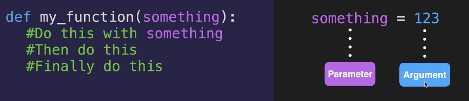
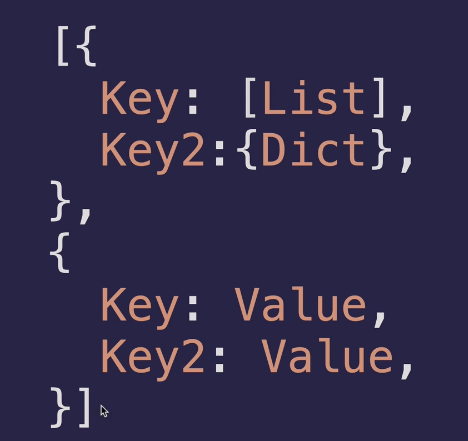

# function
```

def function():

def function(x, y):
# do sth with x, y

```



# indentation

similar with the file and folder in the PC

# while loop

```angular2html

while sth-is-true:

```


# dictionary

group together data and tag

think it as a table. every dictionary has 2 parts: key & value.

```angular2html
dic = {
"key_1": "value_1", 
"key_2": "value_2",
123: "value_3"
}

# retrieving items
dic["key_1"]

# editing & adding new items
dic["new_item"] = "new_value"

# initialization & wiping
empty_dic = {}
dic = {}

# looping through, get the keys in dic
for things in dic:
    print(things)
```

# nesting




# function with output 
```angular2html

def function():
    do with something
    return something

# call function
output = function()
```

"return" statement implies the end of the function

# docstrings

a way for us to create documentation as going along in the function

```angular2html
def function():
    """docstrings """

```

# scope

things inside the function are blocked.
```angular2html
def fc_1():
    def fc_2():

fc_2() # can'† call, because fc_2 is in the scope of fc_1()

```

 

```angular2html

game_level = 3
enemies = ["Skeleton", "Zombie", "Alien"]
if game_level < 5:
    new_enemy = enemies[0]
print (new_enemy)
# var. inside the if loop or any other loops, it will not be scoped, it will be counted as global.
```

```angular2html

game_level = 3
def create_enemy () :
    enemies = ["Skeleton", "Zombie", "Alien"]
    if game_level < 5:
        new_enemy = enemies[0]
print (new_enemy)
# this time var. is created inside the function, so it will be scoped
```
# how to debug

1. use print()
2. use debugger python visualizer