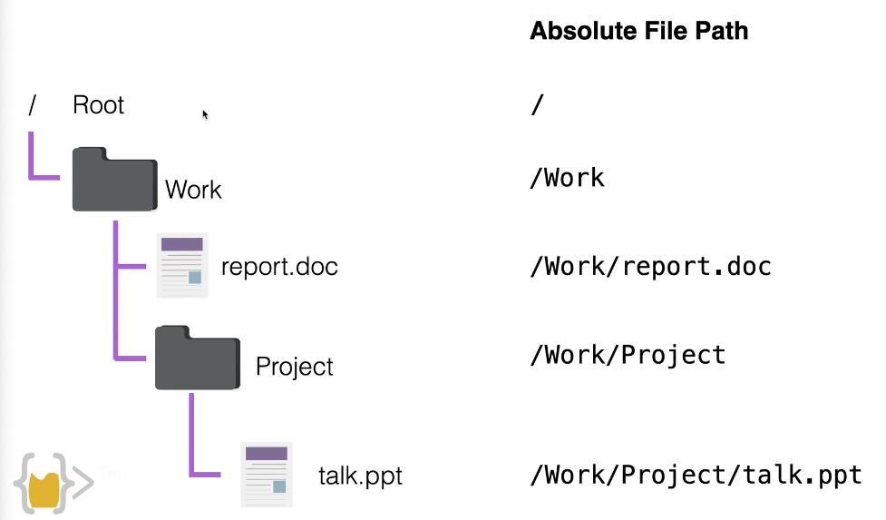
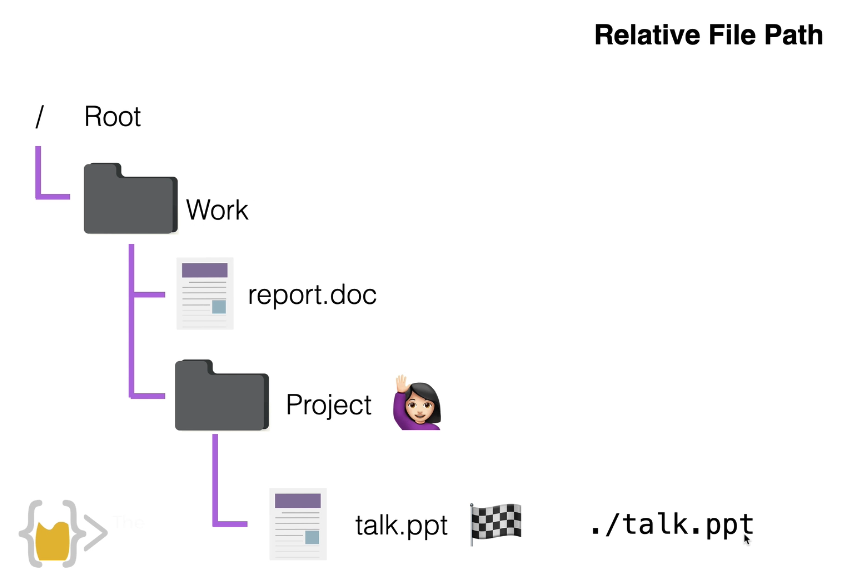
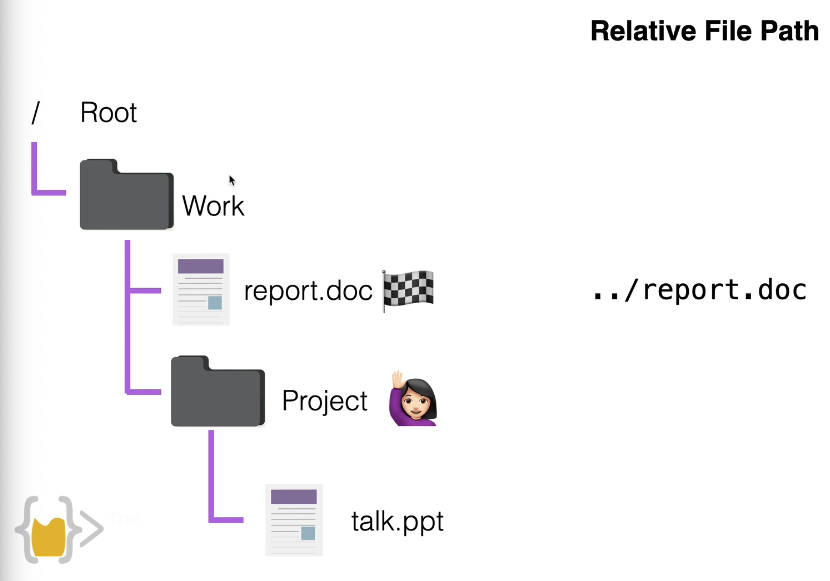

# Section 0

# print commands

1. print(): printing
2. \n: next line
3. +: print combined string
4. input(): get prompt. passing user's input data to the sentence, and user will see the sentence you input in the ()
5. len(): calculate the length of the str

# save variables

Once use "input", the variables input will be saved by the functions, by hold it with a variable, we can access it after.

# variables naming rules

1. make sense to you
2. 1 single unit
3. use "\_" to separate
4. can not use number in the first character

# data types

## strings

a str of characters
str[n] prints out the character in the n+1 place

## integer

whole actual number
1_234-->1,234

## float

decimal number

## boolean

True/False

# type converting

type(): output the type of the input

str(): convert into string data type

int(): convert into int data type

float(): convert into float data type

# operations

+: combine strings;

+,-,\*,/:math operations

\*\*: power.

all the output is float data type

order: (PEMDAS) ()--> \*_ --> _,/ --> +,-

# number manipulation

print(round(8/3.the number you want to round into))

print(8//3) round to 2 decimals

a = a + 1 equals a+=1

# F strings

use when we want to correctly work with different types of data, instead of converting every variables, we can use f str, and python does the converting for correctly output.

```
x=1
y=2.123
print(f"your score is {x} and {y}")
```

# key concepts

if else elif

if condition1 and/or condition2 :

if not condition :

# random module

import random module, askpython.com

module is something to do specific function

create own module is also accessible, just create new python file

# list

list_0 = [sth1, sth2], sth can also be a list.

list[n], n starts from 0 to length

.append("end"): add item to the list

# loop

```
for item in list_of_items:
  actions
```

assign the variable to the items in the list in order

# range

```
for item in range(a, b, *step):
```

# function

```

def function():

def function(x, y):
# do sth with x, y

```


# indentation

similar with the file and folder in the PC

# while loop

```angular2html

while sth-is-true:

```

# dictionary

group together data and tag

think it as a table. every dictionary has 2 parts: key & value.

```angular2html
dic = {
"key_1": "value_1",
"key_2": "value_2",
123: "value_3"
}

# retrieving items
dic["key_1"]

# editing & adding new items
dic["new_item"] = "new_value"

# initialization & wiping
empty_dic = {}
dic = {}

# looping through, get the keys in dic
for things in dic:
    print(things)
```

# nesting


# function with output

```angular2html

def function():
    do with something
    return something

# call function
output = function()
```

"return" statement implies the end of the function

# docstrings

a way for us to create documentation as going along in the function

```angular2html
def function():
    """docstrings """

```

# scope

things inside the function are blocked.

```angular2html
def fc_1():
    def fc_2():

fc_2() # can'† call, because fc_2 is in the scope of fc_1()

```

```angular2html

game_level = 3
enemies = ["Skeleton", "Zombie", "Alien"]
if game_level < 5:
    new_enemy = enemies[0]
print (new_enemy)
# var. inside the if loop or any other loops, it will not be scoped, it will be counted as global.
```

```angular2html

game_level = 3
def create_enemy () :
    enemies = ["Skeleton", "Zombie", "Alien"]
    if game_level < 5:
        new_enemy = enemies[0]
print (new_enemy)
# this time var. is created inside the function, so it will be scoped
```

# how to debug

1. use print()
2. use debugger python visualizer

# Section 1.

# importing modules

way 1:

```angular2html
import module
```

This can be very annoying if constantly using 1 thing in module, such as module.thing

way 2:

```angular2html
from module import Thing
```

In this way we only need to type Thing directly to use it.

way 3:

```angular2html
from module import *
```

If everything in module will be frequently used, import this way. But please avoid.

way 4:

```angular2html
import module as m
```

quite useful way to import, if module has a long name.

If find a module can not be imported, install first.

# read and write file

```
with open('my_file.txt', 'w') as f:
   f.write('Hello, world!')
```

# absolute file path



# relative file path

working directory: the project folder we are now at. use ".\" to represent the current file path




# read CSV files
